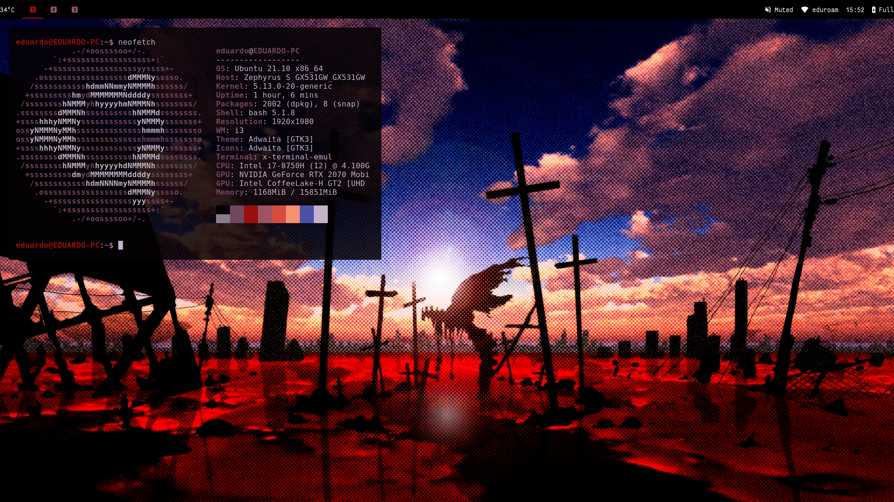

# Educorreia932's Dotfiles 

My current Linux dotfiles and scripts.

# 💻 System Information

These are some of the applications that I use in my current setup.

**Distribution:** NixOS 24.05  
**Desktop Environment:** Gnome 46.2 (Wayland)  
**Shell:** zsh    
**Terminal:** Alacritty    

# 🗃️ Contents
 
- [home](home/) - Home Manager configuration
- [hosts](hosts/) - Host-specific configuration

# 📷 Preview



# Useful Commands

## Rebuild

```sh
sudo nixos-rebuild switch --flake .#asus --impure
```

## Update

```sh
nix flake update
```
